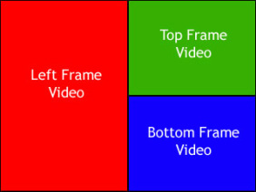

# Video-Layout-Script
It places multiple videos into different sections of frame and encode it to a final video. It uses avs script for coding which is the api language of aviSynth software.

output image

###### Introduction
 "AviSynth is a powerful tool for video post-production. It provides ways of editing and processing videos." - aviSynth wiki

###### Installation
Download [avisynth](https://sourceforge.net/projects/avisynth2/files/AviSynth%202.5/) for windows.

###### Usage
1. Replace the clips in layout.avs, or edit it according to need.
2. Save the file
3. Run the script in [supported players](https://en.wikipedia.org/wiki/AviSynth#AviSynth_compatible_programs).

